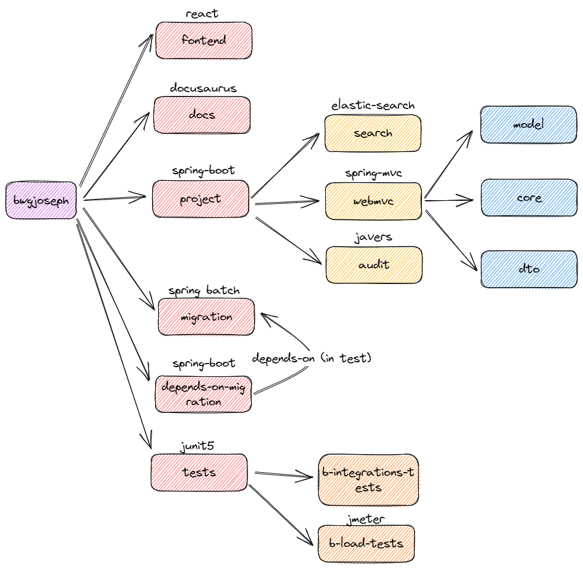

# Maven Nested Multi Module Project

I created this project to learn more about maven multi module project setup, and also validating some ideas I had such as first level (migration) module relying on nested module (mvc-model)

Image below show an overview of what I want to achieve but in general

- Parent POM
- Sub-parent POM
- Different type of project (java/react)

## Challenges

These are some of the challenges that I would need to overcome

- [ ] Can I have multiple parent project (i.e. sub-parent-pom)
  - [ ] How is it managed from the root parent pom?
  - [ ] Can I trigger command to build just the sub-parent pom if I don't want to rebuild everything?
- [ ] How can I build a single (sub-module) project?
- [ ] How do the inherited dependencies work for nested module under sub-parent-pom?
  - [ ] Does it inherit all the way from the root parent pom?

## Status

Still very much work in progress
